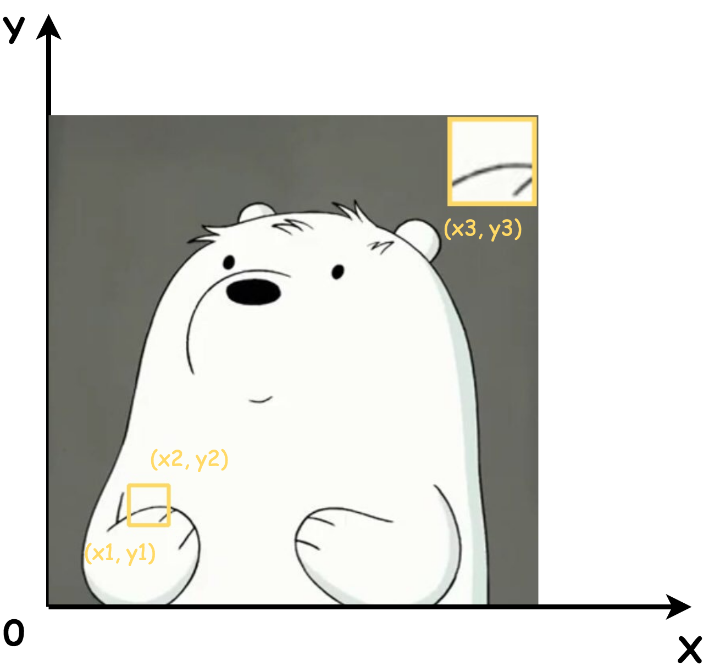

# generate-close-view

This repository is created to generate close view of original image and paste it to the original one.

Can be used in paper writing or slides making.

****
Required input(can be changed in config.py):

* **original_path**: path to load the original image
* **result_pathH**: path to save the result
* **colo_hex**: color to draw the border(hex format)
* **crop_left_bottom**: coordinate of the left bottom point, denoted as *(x1, y1)* in following image
* **crop_right_top**: coordinate of the right top point, denoted as *(x2, y2)* in following image
* **paste_ratio**: ratio to resize the crop_img
* **thickness**: thickness of the border
* **paste_left_bottom**: coordinate of the left bottom point to paste crop_img, denoted as *(x3, y3)* in following image

